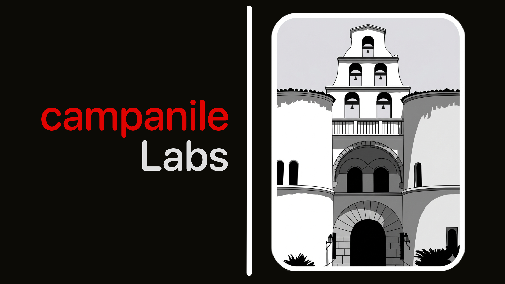

  

# campanile Labs

> Small apps for video, sound &amp; image

An experimental multimedia software lab based in California. I weave open-source
libraries together with my own code, interface design, and artistic detail to
build feature-rich apps for video, audio, and image.

---

## Apps

| App | What it is |
| --- | --- |
| [playful Veo](https://www.campanilelabs.com/apps/playfulVeo.html) | real-time video-effects player |
| [reVid](https://www.campanilelabs.com/apps/revid.html) | video editing app |
| [sonido Diseno](https://www.campanilelabs.com/apps/sonidodiseno.html) | sound design app |
| [Audioforma](https://www.campanilelabs.com/apps/audioforma.html) | audio visualizer that renders to video |
| [Imagen](https://www.campanilelabs.com/apps/imagen.html) | image editor |

[All apps &rarr;](https://www.campanilelabs.com/apps.html)

## Latest from the blog

- [An early look at Audioforma](https://www.campanilelabs.com/blog/blog_00004.html)
- [Haiku OS light as a feather and launches like a rocket on qemu and on my Mac](https://www.campanilelabs.com/blog/blog_00003.html)
- [A first look at the playful Veo interface](https://www.campanilelabs.com/blog/blog_00001.html)
- [one-yolo-coreml: fanning a single CoreML model across many feeds](https://www.campanilelabs.com/blog/blog_00002.html)

[All posts &rarr;](https://www.campanilelabs.com/blog.html)

## Open Source

Open Source Libraries used:

- **Dear ImGui** &mdash; tool panels, editors and debug overlays
- **RtAudio** &mdash; real-time audio I/O across CoreAudio, WASAPI, ALSA and JACK
- **PortAudio** &mdash; alternative low-latency audio capture and playback backend
- **FFmpeg** &mdash; audio/video decode, encode, transcode, mux and filtering
- **OpenGL** &mdash; 2D/3D graphics API, the render path on older hardware
- **Vulkan** &mdash; low-level graphics and compute, the modern render path
- **MoltenVK** &mdash; runs Vulkan on Apple Metal for macOS and iOS
- **FreeType** &mdash; font loading and glyph rasterization for all in-app text
- **zlib** &mdash; DEFLATE compression for asset packing, project files and PNG
- **GLFW** &mdash; window creation, GL/Vulkan context setup and input
- **GLM** &mdash; header-only C++ math (vectors, matrices, quaternions) for graphics
- **FFTW3** &mdash; fast Fourier transforms for spectral analysis and processing

[Full list with licenses &rarr;](https://www.campanilelabs.com/oss.html)

## About

A one-person experimental multimedia software lab in California, run by
**Edsel Malasig** &mdash; open-source libraries woven together with custom code,
interface design and an artistic touch to create cool multimedia software.

[Read more &rarr;](https://www.campanilelabs.com/about.html)
